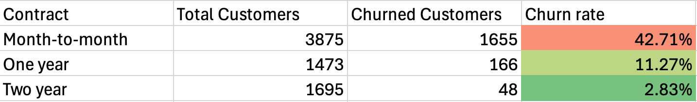
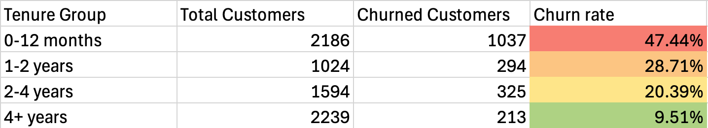
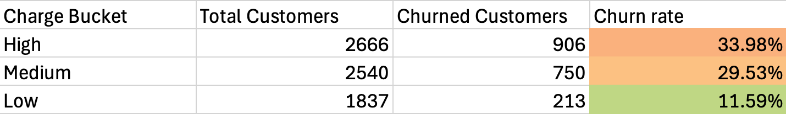
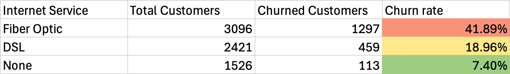
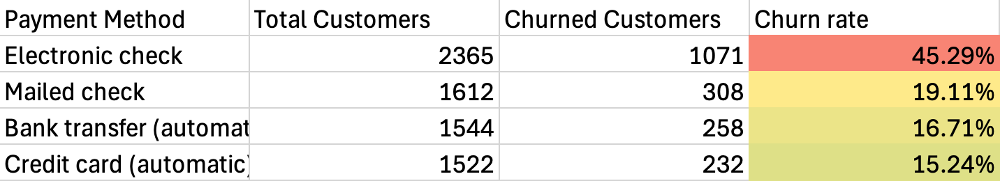
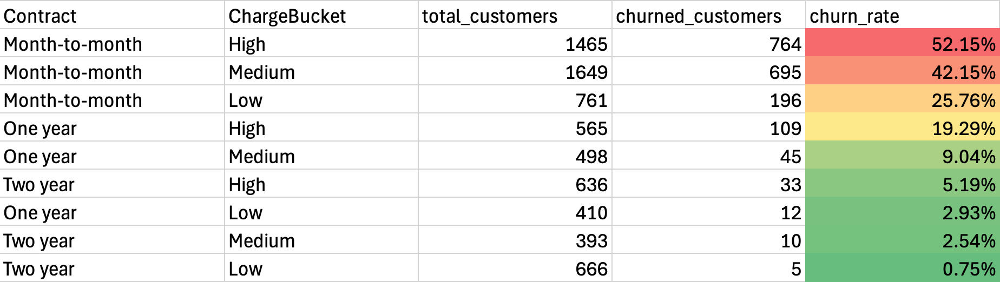
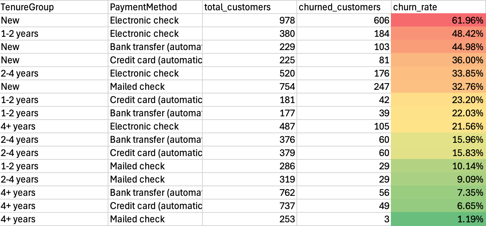

1. What is the overall churn rate?
2. How does churn vary by key segments?
3. What factors seem most related to churn?

# Data preperation in BigQuery
After importing the cleaned CSV into BigQuery, several numeric fields were automatically interpreted as STRING types. This caused errors when running analytical queries. 
To resolve this issue I created a new table using SAFE_CAST to convert these feilds into the correct numeric types. The SQL query I used to create the new table is as follows:

```sql
CREATE TABLE project-1-481514.churn_analysis.cleaned_telco_churn_fixed AS
SELECT 
CustomerID,
Gender,SAFE_CAST(SeniorCitizen AS INT64) AS SeniorCitizen,
Partner,
Dependents,
SAFE_CAST(Tenure AS INT64) AS Tenure,
PhoneService,
MultipleLines,
InternetService,
OnlineSecurity,
OnlineBackup,
DeviceProtection,
TechSupport,
StreamingTV,
StreamingMovies,
Contract,
PaperlessBilling,
PaymentMethod,
SAFE_CAST(MonthlyCharges AS FLOAT64) AS MonthlyCharges,
SAFE_CAST(TotalCharges AS FLOAT64) AS TotalCharges,
Churn,
TenureGroup,
ChargeBucket
 FROM `project-1-481514.churn_analysis.cleaned_telco_churn`
```
The data is now ready for analysis in SQL

# 1. Overall churn rate
Churn rate = customers lost during period / customers at start of period  
In our dataset we are given 'churn' as a boolean string type so our new equation will be:  
Churn rate = Churn=true / customers at start of period  

```sql
-- Total customers
SELECT COUNT(*) AS total_customers
FROM project-1-481514.churn_analysis.cleaned_telco_churn_fixed;
```
The total number of customers is 7043

```sql
-- Churned customers
SELECT COUNT(*) AS churned_customers
FROM project-1-481514.churn_analysis.cleaned_telco_churn_fixed 
WHERE Churn = true;
```
The total number of churned customers is 1869

```sql
-- Churn rate
SELECT COUNT(CASE WHEN Churn = true THEN 1 END)*1.0/COUNT(*) AS churn_rate
FROM project-1-481514.churn_analysis.cleaned_telco_churn_fixed;
```
1869/7043 = 0.265369...  
Therefore our churn rate is 26.54%

# 2. Churn by customer segments 
In this part we will answer:  
- Which segments churn the most?
- How does churn vary by contract, tenure, charges, etc.?

## 2.1 Churn by contract type
```sql
-- Churn by contract type
SELECT 
 Contract,
 COUNT(*) AS total_customers,
 COUNT(CASE WHEN Churn = true THEN 1 END) AS churned_customers,
 COUNT(CASE WHEN Churn = true THEN 1 END)*1.0/COUNT(*) AS churn_rate
FROM project-1-481514.churn_analysis.cleaned_telco_churn_fixed 
GROUP BY Contract
ORDER BY churn_rate DESC;
```
  

- Month-to-month: 42.71% churn rate  
- One-year contract: 11.27% churn rate  
- Two-year contract: 2.83% churn rate

## 2.2 Churn by tenure group
```sql
-- Churn by tenure group
SELECT 
 TenureGroup,
 COUNT(*) AS total_customers,
 COUNT(CASE WHEN Churn = true THEN 1 END) AS churned_customers,
 COUNT(CASE WHEN Churn = true THEN 1 END)*1.0/COUNT(*) AS churn_rate
FROM project-1-481514.churn_analysis.cleaned_telco_churn_fixed 
GROUP BY TenureGroup
ORDER BY churn_rate DESC;
```
  

- New (0-12 months): 47.44% churn rate  
- 1-2 years: 28.71% churn rate
- 2-4 years: 20.39% churn rate
- 4+ years: 9.51% churn rate

## 2.3 Churn by monthly charge 
```sql
-- Churn by monthly charge bucket
SELECT 
 ChargeBucket,
 COUNT(*) AS total_customers,
 COUNT(CASE WHEN Churn = true THEN 1 END) AS churned_customers,
 COUNT(CASE WHEN Churn = true THEN 1 END)*1.0/COUNT(*) AS churn_rate
FROM project-1-481514.churn_analysis.cleaned_telco_churn_fixed 
GROUP BY ChargeBucket
ORDER BY churn_rate DESC;
```


- High charges: 33.98%  
- Medium charges: 29.53%  
- Low charges: 11.59%

# 3. Churn by service and payment method
## 3.1 Churn by internet service type
```sql
-- Churn by internet service type
SELECT 
 InternetService,
 COUNT(*) AS total_customers,
 COUNT(CASE WHEN Churn = true THEN 1 END) AS churned_customers,
 COUNT(CASE WHEN Churn = true THEN 1 END)*1.0/COUNT(*) AS churn_rate
FROM project-1-481514.churn_analysis.cleaned_telco_churn_fixed 
GROUP BY InternetService
ORDER BY churn_rate DESC;
```


- Fiber Optic: 41.89%
- DSL: 18.96%
- None: 7.4%

## 3.2 Churn by payment method
```sql
-- Churn by Payment method
SELECT 
 PaymentMethod,
 COUNT(*) AS total_customers,
 COUNT(CASE WHEN Churn = true THEN 1 END) AS churned_customers,
 COUNT(CASE WHEN Churn = true THEN 1 END)*1.0/COUNT(*) AS churn_rate
FROM project-1-481514.churn_analysis.cleaned_telco_churn_fixed 
GROUP BY PaymentMethod
ORDER BY churn_rate DESC;
```


- Electronic check: 45.29%
- Mailed check: 19.11%
- Bank transfer: 16.71%
- Credit card: 15.24%

# 4. Churn by combined factors
## 4.1 Contract type vs Monthly charge
```sql
SELECT 
 Contract,
 ChargeBucket,
 COUNT(*) AS total_customers,
 COUNT(CASE WHEN Churn = true THEN 1 END) AS churned_customers,
 COUNT(CASE WHEN Churn = true THEN 1 END)*1.0/COUNT(*) AS churn_rate
FROM project-1-481514.churn_analysis.cleaned_telco_churn_fixed 
GROUP BY Contract, ChargeBucket
ORDER BY churn_rate DESC;
```


- Month-to-month & High charges: 52.15%
- Month-to-month & Medium charges: 42.15%
- Month-to-month & Low charges: 25.76%  
When multiple risk factors overlap - in this case contract type and monthly charges - churn rates rise sharply. Churn is highest when customers are both on month-to-month contracts and paying medium or high monthly charges. This makes sense from a behaviour perspective:
- Month-to-month customers can switch easily.
- Higher-paying customers are more price-sensitive and expect more value.

In contrast, customers on one or two year contracts paying lower charges are far more stable.

## 4.2 Tenure vs Payment method
```sql
SELECT 
 TenureGroup,
 PaymentMethod,
 COUNT(*) AS total_customers,
 COUNT(CASE WHEN Churn = true THEN 1 END) AS churned_customers,
 COUNT(CASE WHEN Churn = true THEN 1 END)*1.0/COUNT(*) AS churn_rate
FROM project-1-481514.churn_analysis.cleaned_telco_churn_fixed 
GROUP BY TenureGroup, PaymentMethod
ORDER BY churn_rate DESC;
```


Tenure and payment method interact strongly: early-tenure customers using manual payment methods churn at significantly higher rates than long-tenure customers using automatic payments. This shows that churn is driven by both customer maturity and billing friction. 

# Executive summary

Churn in this dataset is driven by a number of different factors including:
- Contract flexibility
- Early-tenure vulnerability
- High monthly charges
- Manual payment methods

Customers who fall into more than one of these categories churn at dramatically higher rates.

## Tenure Group is the strongest single predictor of churn
Customers in their first year of subscribing churn at a rate of 47.44%. 

## Payment method strongly influences churn 
Manual payment methods adds friction and correlates with churn. Shifting customrs to automatic payment methods is a low-cost, high-impact retention strategy.
