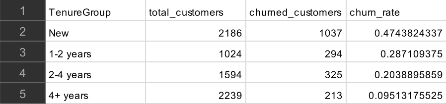
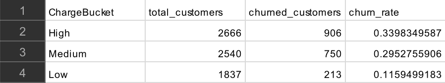

1. What is the overall churn rate?
2. How does churn vary by key segments?
3. What factors seem most related to churn?

## Data preperation in BigQuery
After importing the cleaned CSV into BigQuery, several numeric fields were automatically interpreted as STRING types. This caused errors when running analytical queries. 
To resolve this issue I created a new table using SAFE_CAST to convert these feilds into the correct numeric types. The SQL query I used to create the new table is as follows:

```sql
CREATE TABLE project-1-481514.churn_analysis.cleaned_telco_churn_fixed AS
SELECT 
CustomerID,
Gender,SAFE_CAST(SeniorCitizen AS INT64) AS SeniorCitizen,
Partner,
Dependents,
SAFE_CAST(Tenure AS INT64) AS Tenure,
PhoneService,
MultipleLines,
InternetService,
OnlineSecurity,
OnlineBackup,
DeviceProtection,
TechSupport,
StreamingTV,
StreamingMovies,
Contract,
PaperlessBilling,
PaymentMethod,
SAFE_CAST(MonthlyCharges AS FLOAT64) AS MonthlyCharges,
SAFE_CAST(TotalCharges AS FLOAT64) AS TotalCharges,
Churn,
TenureGroup,
ChargeBucket
 FROM `project-1-481514.churn_analysis.cleaned_telco_churn`
```
The data is now ready for analysis in SQL

## 1. Overall churn rate
Churn rate = customers lost during period / customers at start of period  
In our dataset we are given 'churn' as a boolean string type so our new equation will be:  
Churn rate = Churn=true / customers at start of period  

```sql
-- Total customers
SELECT COUNT(*) AS total_customers
FROM project-1-481514.churn_analysis.cleaned_telco_churn_fixed;
```
The total number of customers is 7043

```sql
-- Churned customers
SELECT COUNT(*) AS churned_customers
FROM project-1-481514.churn_analysis.cleaned_telco_churn_fixed 
WHERE Churn = true;
```
The total number of churned customers is 1869

```sql
-- Churn rate
SELECT COUNT(CASE WHEN Churn = true THEN 1 END)*1.0/COUNT(*) AS churn_rate
FROM project-1-481514.churn_analysis.cleaned_telco_churn_fixed;
```
1869/7043 = 0.265369...  
Therefore our churn rate equals 26.54%

## 2. Churn by customer segments 
In this part we will answer:  
- Which segments churn the most?
- How does churn vary by contract, tenure, charges, etc.?

## 2.1 Churn by contract type
```sql
-- Churn by contract type
SELECT 
 Contract,
 COUNT(*) AS total_customers,
 COUNT(CASE WHEN Churn = true THEN 1 END) AS churned_customers,
 COUNT(CASE WHEN Churn = true THEN 1 END)*1.0/COUNT(*) AS churn_rate
FROM project-1-481514.churn_analysis.cleaned_telco_churn_fixed 
GROUP BY Contract
ORDER BY churn_rate DESC;
```
  

- Month-to-month: 42.7% churn rate  
- One-year contract: 11.3% churn rate  
- Two-year contract: 2.8% churn rate  
Customers on month-to-month contracts churn at a significantly higher rate than customers on longer-term contracts, making contract type one of the strongest predictors of churn.
This pattern suggests that customers with greater flexibility are more likely to leave, while longer-term contracts create stability and reduce churn.

## 2.2 Churn by tenure group
```sql
-- Churn by tenure group
SELECT 
 TenureGroup,
 COUNT(*) AS total_customers,
 COUNT(CASE WHEN Churn = true THEN 1 END) AS churned_customers,
 COUNT(CASE WHEN Churn = true THEN 1 END)*1.0/COUNT(*) AS churn_rate
FROM project-1-481514.churn_analysis.cleaned_telco_churn_fixed 
GROUP BY TenureGroup
ORDER BY churn_rate DESC;
```
  

- New (0-12 months): 47.4% churn rate  
- 1-2 years: 28.7% churn rate
- 2-4 years: 20.4% churn rate
- 4+ years: 9.5% churn rate
Nearly half of all customers in their first year churn, and almost one-third leave within two years. This tells us that customers who have not yet built loyalty or perceived value are far more likely to leave. Churn declines steadily as tenure increases, indicating that long-standing customers are significantly more stable. 

## 2.3 Churn by monthly charge bucket
```sql
-- Churn by monthly charge bucket
SELECT 
 ChargeBucket,
 COUNT(*) AS total_customers,
 COUNT(CASE WHEN Churn = true THEN 1 END) AS churned_customers,
 COUNT(CASE WHEN Churn = true THEN 1 END)*1.0/COUNT(*) AS churn_rate
FROM project-1-481514.churn_analysis.cleaned_telco_churn_fixed 
GROUP BY ChargeBucket
ORDER BY churn_rate DESC;
```


- High charges: 33.9%  
- Medium charges: 29.5%  
- Low charges: 11.6%  
Churn increases significantly as monthly charges rise, indicating that higher-paying customers are more likley to feel dissatisfied or perceive lower value for money. The jump from low to medium charges is especially steep, indicating that customers moving into mid-tier plans experience a mismatch between expectations and actual service quality. Retaining medium and high charge customers should be a priority, as they contribute more revenue and churn at higher rates.
